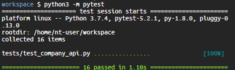
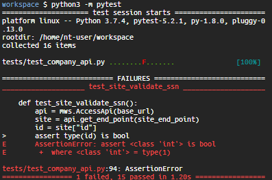

Now that the `AccessApi` class has been created, we must create tests for each of the API endpoints. 

Schema’s of response JSON’s
* *getBillingInfo.json*
```json
    "id": < INT>,
    "FirstName": <STRING>,
    "LastName": <STRING>,
    "city": <STRING>,
    "state": <STRING>,
    "Lang": <STRING>,
    "SSN":<STRING>
```

* *getCustomers.json*
```json
"id": < INT>,
  "first_name": <STRING>,
  "last_name":<STRING>,
  "email":<STRING>,
  "ip_address":<STRING>,
  "address": <STRING>
```

* *getSites.json*
```json
"id": <INT>,
  "address": <STRING>,
  "ThirdParty":<STRING>,
  "admin": <STRING>
```

In the file *test_company_api.py*, you will find test method stubs. Create the following four tests for each of the API endpoints:
1. Validate the HTTP status code is **200**.
2. Validate the schema matches the one provided on a very simple level. Determine that the JSON keys are correct. For example, in getSites check that there are 4 keys: **id**, **address**, **ThirdParty** and **admin**. Also check that the type of the value matches the schema provided. A schema is the layout of the data, which could be columns in a spreadsheet or key’s and nested key’s in a dictionary. To validate the schema, you would verify that the structure matches what is expected. 

3. Validate the accuracy of the data by picking a random data element and verifying the data is in the correct format. For example, a SSN should be all integers, in a format of XXX-XX-XXXX. 
4. Validate that the response time should be less than one minute. 

Endpoints:

•	Billing

•	Sites

•	Customers

The JSON files can be found [here](https://github.com/cengage-ide-content/APItesting). For now, please use: https://raw.githubusercontent.com/cengage-ide-content/ as the base URL. For example https://raw.githubusercontent.com/cengage-ide-content/APItesting/main/getBillingInfo.json. 

A simple pytest looks like as follows:
```python
def <test_name>(<args>):                  
    <setup code for test>
    assert <an expression that tests and has a True or False outcome>
```

A simple example is as follows:
```python
def testing_my_class(age:int):
    assert age <= 50                                           
```

Run your test file by entering `python3 -m pytest` in the terminal. You may slight variations but your terminal should like one of the following: 

Successful Test Run:



Unsuccessful Test Run:



