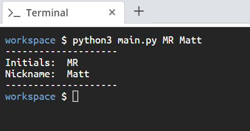

<!-- practice -->
# Scenario
You have been asked to generate a simple Python script that will print a name card consisting of the initials of a name and a nickname. 

# Aim
Create a Python Script that executes from the command line. It should take the initials and nickname of a name as arguments and give the output as shown in *Figure 1.6*. 

# Steps for Completion
1. Go to your *main.py* file and import the `sys` built-in python module.
2. Use two `print` statements to print `Initials:` and `Nickname:`. Also, use these print statements to print 20 dashes (`-`) as borders above and below the initials and nickname.
3. Two parameters should be passed with the script: one for the initials and the second for the nickname.
4. Run the script with the *python3 main.py* command and pass two string arguments.

> If upon run you get the following error: *IndexError: list index out of range*. Make sure to pass two string arguments when running the script, like the example below. 

Your output should be similar to *Figure 1.6*:

*Figure 1.6*
