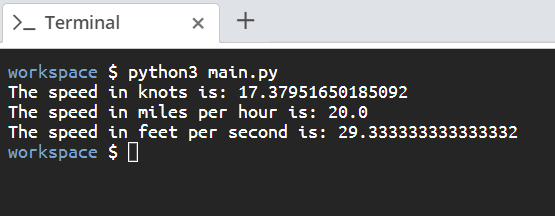

# Scenario

You are creating a simple Python script that takes a distance and a completion time and outputs the speed in knots, miles per hour, and feet per second.

# Aim

Using variables write a script that defines a distance of 60 miles and a completion time of 3 hours. The output should show a completion speed in miles per hour, knots, and feet per second.

Here are some hints:

- The formula for calculating speed is **distance/time = speed**.
- To convert miles to knots, divide the miles by 1.15078.
- To convert miles to feet, multiply the miles by 5280.
- To convert hours to seconds, multiply hours by 3600.
- The output should resemble _Figure 1.8_ shown below.

# Steps for Completion

1. Go to your _main.py_ file.

2. On the first two lines, declare two variables for the distance in miles and time in hours and assign the values **60** and **3**, respectively.

3. In the next two lines, calculate the distance in knots and distance in feet based on the distance in miles.

4. Then, calculate the time in seconds based on the time in hours.

5. Next, calculate the speed in knots, speed in miles per hour, and speed in feet per second.

6. Finally, add `print` statements to print out the results.

7. In your terminal, run the script by using the _python3 main.py_ command.

The output should be like _Figure 1.8_, shown below:

_Figure 1.8_
