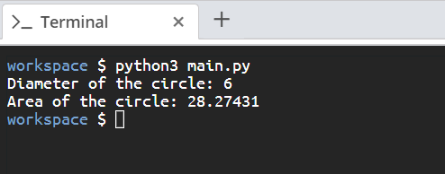

# Scenario
You are creating a simple Python script that calculates the diameter and area of a circle. 

# Aim
Using a Python script run on the command line,  calculate the diameter and area of a circle with a radius of 3. In this activity, we'll get better acquainted with variable assignment as well as variable naming conventions. 

Here are some hints: 

- The formula for calculating diameter is **2 \* r**.
- The formula for calculating area is **π \* r^2** , **r** being the radius. 
- π can be approximated to 3.14159. 

# Steps for Completion

1. Open the *main.py* file in your editor. 

2. On the first two lines, declare your constant, π (`PI`), and the `radius` of the circle with a value of **3**  

3. Write the lines to run your calculations. 

4. Display the results by using `print` statements. 

5. Run the script by using the *python3 main.py* command. 

The output should look like *Figure 1.9*:

*Figure 1.9*

>Hint: To calculate an exponent use ** as ^ in the code editor window.

