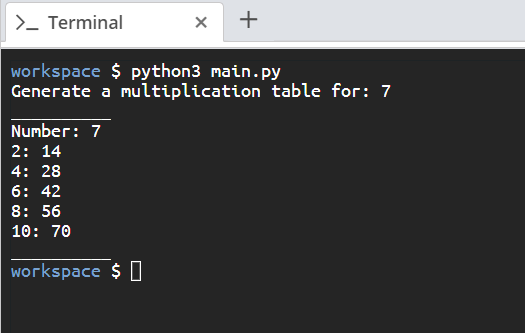

# Aim

Write a script that takes a whole number from a user’s input and prints out its 2's multiplication table till 10.

# Steps for Completion

1. Go to your _main.py_ file.

2. On the first line, add a docstring explaining what your file does. Then, assign a variable called **whole_num** to the user’s input and cast it to an integer.

3. Next, print 10 underscores as the top border of the table.

4. On the first line print your whole number, then multiply your whole number by multiples of 2's till 10 and print that out.

5. Finally, print 10 underscores again for the bottom border of the table, as in step 3.

6. Run the file by using the _python3 main.py_ command.

The output should be like _Figure 1.10_:

_Figure 1.10_
