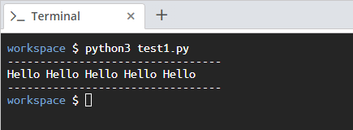

<!-- practice -->

# Aim

Create a script that displays `Hello` five times in a single line.

# Steps for Completion

In your file named _test1.py_, insert the code in _Snippet 1.5_:

```python
print("---------------------------------")
print("Hello " * 5)
print("---------------------------------")
```

<sup>_Snippet 1.5_</sup>

In your terminal, run the following command: `python3 test1.py`. You should see the output shown in _Figure 1.2_:


<sup>_Figure 1.2_</sup>
