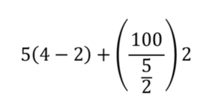

# Scenario

In this challenge, we will try to get conversant with the order of arithmetic operators in Python. Rewrite the following equation as a Python expression and get the result of the equation:

Python follows the mathematical rules that you're accustomed to. A lot of what you'd expect to work mathematically can be intuitively tried out in Python, and will often work.
