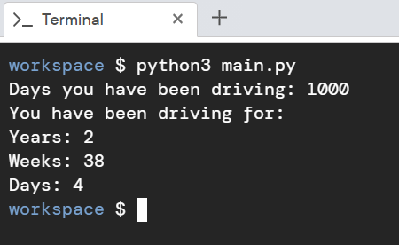

# Scenario

You are given the number of days that you have been driving, and you will write a Python script to work out the equivalent number of years and weeks.

# Aim

Write a script that takes user input as days and converts the days into years, weeks, and days, and then prints them out. We can ignore leap years. The aim of this activity is to use different arithmetic operators to split days into years, weeks, and days.

# Steps for Completion

1. Go to your _main.py_ file.

2. On the first line, ask the user how many days they've been driving for and declare the user input. It's an integer, so cast the string.

3. Then calculate the number of years in that set of days.

4. Next, convert the remaining days that weren't converted to years into weeks.

5. Then, get any remaining days that weren't converted to weeks.

6. Print everything out.

7. Finally, run the script with the _python3 main.py_ command.

8. The output should look like _Figure 2.5_ shown below:

_Figure 2.5_
