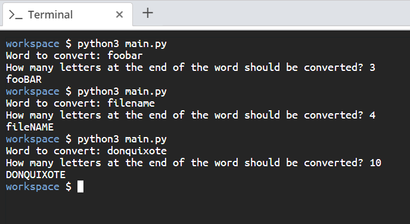

# Scenario

You will create a Python script that will take a user's input and convert lower case letters in the string into upper case letters depending on the user input.

# Aim

Write a script that converts the `count` amount of letters starting from the end of a given word to uppercase. The script should take the word as a string and specify the `count` amount of letters to convert as an integer input from the user. You can assume that the `count` variable will be a positive number.

# Steps for Completion

1. Open your _main.py_ file.

2. On the first line, request the string to convert from the user.

3. On the next line, request how many letters at the end of the word should be converted, cast the input to type `int` and save their input to a variable named **count**.

4. Next, get the start of the string.

5. Then, get the ending of the string, that is, the one we'll be converting.

6. Then, concatenate the first and last part back together, with the last substring transformed.

7. Finally, run the script with the _python3 main.py_ command

The output should look like _Figure 2.8_ below:

_Figure 2.8_
