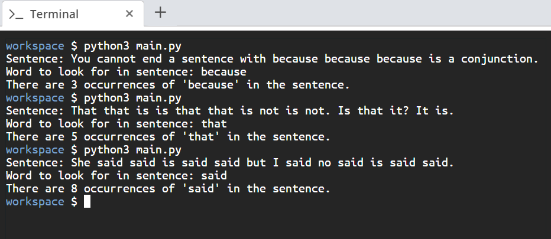

# Scenario
You want to write a Python script that takes a string and counts the occurrence of a specified word. 

# Aim
Write a script that counts and displays the number of occurrences of a specified word in a given excerpt. The script should request two input values from the user, that is, the excerpt and the word to search for. You can assume that the word will not occur as a substring in other words.

# Steps for Completion
1. Go to your *main.py* file.

2. Take in the user input for the sentence and the substring.

3. Next, sanitize and format the input by removing the whitespace and converting it to lowercase.

4. Count the occurrences of the substring.

5. Print the results.

6. Run the script by using the *python3 main.py* command

The output should look like *Figure 2.11* shown below:

*Figure 2.11*
