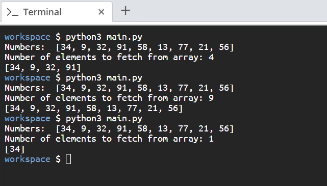

# Scenario

Write a program that fetches the first `count` amount of elements of a list.

# Aim

Create a script that contains the array **[34, 9, 32, 91, 58, 13, 77, 21, 56]**. The script will take a user input `count` that defines the number of elements to fetch from an array and then outputs those elements.

# Steps for Completion

1. Go to your _main.py_ file.

2. On the first line, create the following array:

   ```python
   numbers = [34, 9, 32, 91, 58, 13, 77, 21, 56]
   ```

3. Next, print the array `numbers` and fetch the user input `count` for the number of elements to fetch from the array.

4. Finally, print out the slice of the array from the first element to the n<sup>th</sup> element.

5. Then, run the script by using the _python3 main.py_ command

The output should look like _Figure 2.12_ shown below:



<sup>_Figure 2.12_</sup>
