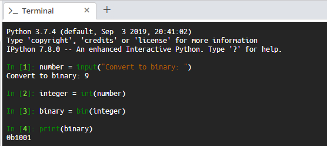

<!-- practice -->

# Aim

Practice converting between different types of number systems. We will create a script that takes the user's input and converts it into a binary number.

# Steps for Completion

1. First, define the `number` variable that takes a user input:

```python
number = input("Convert to binary: ")
```

2. Convert the input to an integer:

```python
# convert number to integer
integer = int(number)
```

3. Then, convert it to a binary number:

```python
# convert integer to binary
binary = bin(integer)
```

4. Finally, print out the value:

```python
print(binary)
```

The final script should resemble _Snippet 2.9_ shown below:

```python
In [1]: number = input("Convert to binary: ")
Convert to binary: 9
# convert number to integer
In [2]: integer = int(number)
# convert integer to binary
In [3]: binary = bin(integer)
In [4]: print(binary)
0b1001
```

<sup>_Snippet 2.9_</sup>

5. The running script should look like the one shown in _Figure 2.1_:



<sup>_Figure 2.1_</sup>

> When a number in preceded by `0b` it indicates the number is in binary notation. If the number is preceeded by `0x` it is in hex notation.
