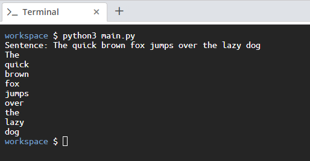

<!-- practice -->

# Aim

Write a Python script that breaks down all the words of a sentence and prints each word on its own line. The goal of this exercise is to get familiar with escape sequences:

# Steps for Completion

1. Go to your _main.py_ file and in the first line, request the sentences to split from the user:

```python
sentence = input("Sentence: ")
```

2. Next, replace all of the spaces in the sentence with newline characters:

```python
sentence = sentence.replace(" ", "\n")
```

3. Finally, print out the sentence. Each word should appear on a new line as shown in _Snippet 2.60_:

```python
sentence = input("Sentence: ")
sentence = sentence.replace(" ", "\n")
print(sentence, "\a")
```

<sup>_Snippet 2.60_</sup>

4. You can run the script by using the `python3 main.py` command. An example is shown in _Figure 2.10_ below:



<sup>_Figure 2.10_<sup>
