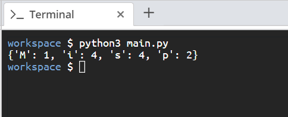

# Scenario

Given a word, write a function that will output a dictionary that will give each character of the word and its frequency.

# Aim

Due to its key-value pair format, dictionaries can be used to present some forms of structured data in an easily readable way. This challenge will help you write code to present frequency data for characters in strings.

Dictionaries are very good data structures for organizing data in a readable format. Your aim is to write a function called **word_counter**, which will take in a line of text and output a dictionary with each letter as a key, the value being the frequency of appearance of the letter.

Here are some hints to help you out:

• Treat different uppercase and lowercase letters separately. For example, `M` and `m` should have different counts.

• Drop empty spaces.

• Assume that sentences will not have any special characters.

# Steps for Completion

1. Define the function `word_counter` and have it take a string argument.

2. Iterate through the string and count the occurrences of each character.

3. Output each character as a key in the output dictionary, with the frequency as the value.

4. At the end of your script, call the `word_counter` function as shown in _Snippet 6.46_, pass it the string "Mississippi" and print it to the console. Here is an example:

```python
print(word_counter("Mississippi"))
```

<sup>_Snippet 6.46_</sup>

5. Run the script using `python3 main.py`, the output should look like _Figure 6.1_:



<sup>_Figure 6.1_</sup>
