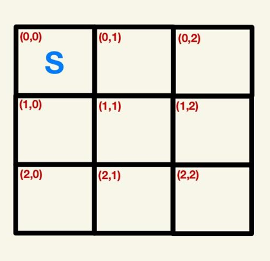

# Complete the `generate_empty_map(available_coordinates)` function

The input to this function is a list of all the possible coordinates that you created from the previous task. This function needs to create a dictionary that maps a given coordinate with the symbol occupying that space. At the beginning, every coordinate should be initialized with a space (**‘ ‘**), with the exception of the (0,0) coordinate, which should be the initial position of the spacecraft (marked with an **‘S’**). The function should return the dictionary.

For example, a 3 x 3 grid is initialized as follows:

