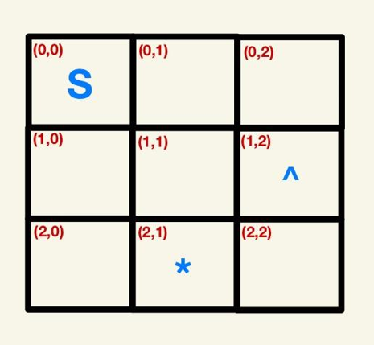

# Complete the `get_unique_objects(galaxy_map)` function

The input to the function should be the galaxy map dictionary (that is, the grid). The grid starts off unpopulated. This function needs to return a frozen set of unique objects in the galaxy (that is, the symbols, including the spacecraft). So, as an example, the unique objects in the following grid are `{’S’, ’^’, ’*’}`:

