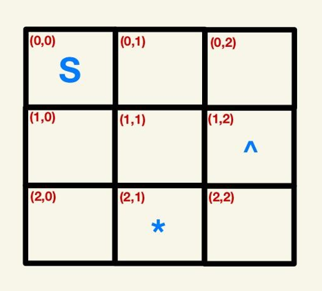

# Complete the `display_galaxy(galaxy_map)` function

The input for this function is the galaxy map dictionary. This function needs to return a string representation of the galaxy map according to the (x,y) coordinates in the dictionary. The best way to do this is to iterate over all of the coordinates and concatenate the string stored at the coordinate in the grid into a large string, and then return the string. For example, the output of the following galaxy would be **’S    ^ * ‘**. Take note that the spaces are also captured:

The next part of the galaxy exploration is to populate the galaxy map with information received from the space agency. 

The space agency has a station that sweeps outer space and detects nearby objects and their coordinates. The next group of tasks are focused on receiving information from the station and then populating the galaxy map accordingly. The `generate_object()` function provided for you receives information from the space agency in the form of *symbol*, *coordinate*.
