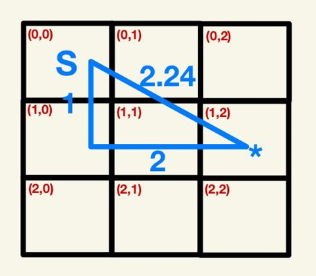

# Complete the `calculate_euclidean_distance()` function

In order to be able to complete the `populate_galaxy_map()` function, you must first complete the `calculate_euclidean_distance()` function. 
This function takes a coordinate as an input and calculates the Euclidian distance from the starting position of the spacecraft, (0,0), to the input coordinates.

Currently, the function just returns 0, but this needs to be replaced with your own code for the distance calculation. Additionally, ensure that the return type is an integer. 

The formula for the Euclidean distance is *distance(x,y) = sqrt(x^2 + y^2)*.

As an example, the Euclidean distance between the following points is *sqrt(1^2 + 2^2) = sqrt(5) = 2.24*, which, when put through the int function in Python, gives *int(2.24) = 2*:

