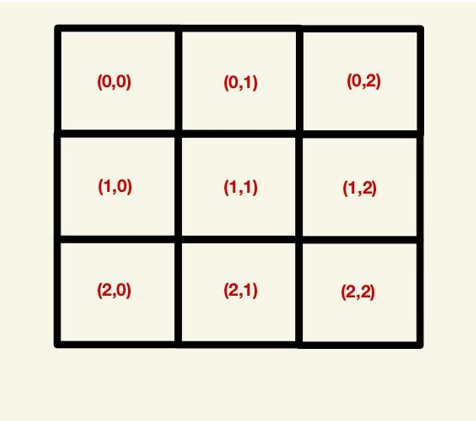
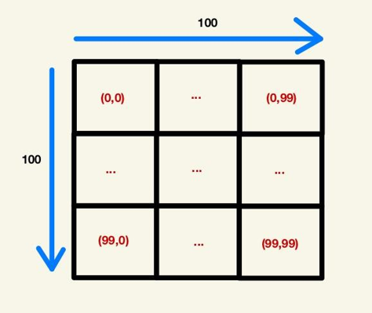

# Scenario

You work in a government department in IT that deals with space exploration. You are asked to write a program in Python that simulates space exploration. The organization has asked you to create and populate a galaxy map and then analyze two exploration missions for their results. To summarize, the to-do list is as follows in this scenario:

1.  Create the galaxy map
2.  Populate the galaxy map
3.  Analyze two exploration missions

# Create the Galaxy Map

Before exploration can even commence, you need to create a map of the known galaxy. In order to do this, you are given the size of the galaxy to explore through the MAP_SIZE variable. For example, if the MAP_SIZE global variable is equal to 10, then this means that the galaxy to explore is a 10 x 10 grid. Since the MAP_SIZE = 100, this implies that the galaxy is a 100 x 100 grid for this challenge. Each square in this grid can be uniquely identified by a tuple, which is an (x,y) coordinate. As an example, a 3 x 3 grid will look like this:

In this project, since this is a 100 x 100 grid, the grid will look like this:

