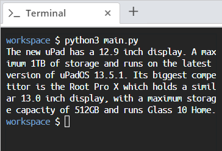

# Aim
Suppose you are a backend developer for a tech news platform. You have been asked to design a templating system for their news articles. To do this, you will need to run some proof of concepts.

# Steps for Completion

1. Define the `TabletComputer` class in the *main.py* file so that the code in *Snippet 7.19* runs without error:

```python
# Write your TabletComputer class here

uPad = TabletComputer(12.9, "1TB", "uPadOS 13.5.1")
rootProX = TabletComputer(13.0, "512GB", "Glass 10 Home")

print(f"The new uPad has a {uPad.screen_size}"
	f" inch display. A maximum {uPad.storage} of storage and runs on"
    f" the latest version of {uPad.os}. Its biggest competitor is"
    f" the Root Pro X which holds a similar {rootProX.screen_size}"
    f" inch display, with a maximum storage capacity of {rootProX.storage} and runs {rootProX.os}."
      )
```
<sup>*Snippet 7.19*</sup>

2. Define the `__init__` function within the `TabletComputer` class with the necessary parameters to set up the member variables.

You will need to set the following member variables: 
* `screen_size`
* `storage`
* `os`


3. After defining the class, running the preceding code should yield the output shown in *Figure 7.1*:



<sup>*Figure 7.1*</sup>
