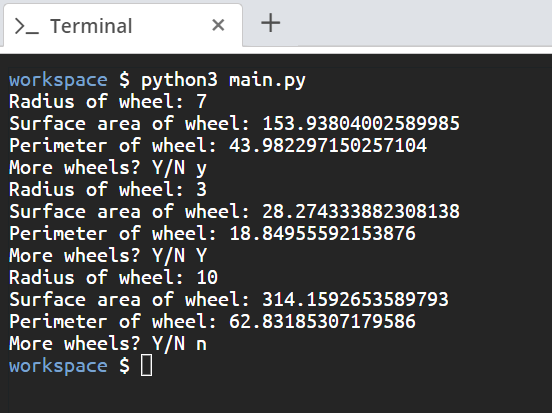

# Scenario
You are part of a race team building a program to help children learn math in a fun way. Currently, you're building a module on shapes, more specifically, calculating the circumference and area of circles.

# Aim
The formula for calculating the circumference of a circle is **2\*π\*r**. The formula for calculating the area of a circle is **π\*r\*r**. 

Write a Python class named `Wheel`, constructed by a radius and two methods, which will calculate the perimeter (circumference) and the surface area of a wheel (circle). 
* The script should ask for the user's input for the radius, create a `Wheel` object, and print out its surface area and perimeter.
* It should ask for the user's input again after it prints the surface area and perimeter each time.
* You should use the `math` modules and set the `pi` constant as your value for pi.

Our aim here is to practice defining methods in a class.

# Steps for Completion

1. Open the file named *main.py*.

2. Define the `Wheel` class and the `Wheel` constructor method.

3. Create the `wheel_area` calculation method, which returns the surface area of the wheel.

4. Create the `wheel_perimeter` calculation method, which returns the perimeter of the wheel.

5. Create the `swap_radius` method, which sets `new_radius` as the radius of the wheel when requested from user input.

6. After the class definition, add the code that requests for user input for the radius of the wheel.

7. Create a `__main__` and add a `while` loop so that the request for user input runs multiple times. In the `while` loop, we'll request the user input, change the `Wheel` object's radius using the `swap_radius` method, and then print out the surface area and perimeter of the wheel.

> Make sure that your program terminates properly when the user indicates they would like to quit. 

8. You can run the script by using *python3 main.py* command. The script will ask for user input, calculate the surface area and perimeter, print that out, and ask for your input again. The output should look like *Figure 7.2*:

*Figure 7.2*
