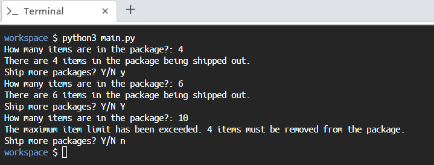

# Scenario
Suppose you are designing a piece of software for a packaging company. A part of the software involves an items capacity limit mechanism to prevent a package from being shipped when it's filled past its capacity.

# Aim
Define a class called `Package`, which will have a maximum item capacity of **6**. 
* The package should be initialized with the number of items.
* If the number of items exceeds the capacity limit during initialization, it should print out a message indicating that the limit has been exceeded and only initialize how many items should be removed from the package.
* Otherwise, if the number of items does not exceed the limit, it should print out a message that includes how many items are in the package.

Our aim here is to practice creating class attributes.

# Steps for Completion

1. Go to you `main.py` file.

2. In the space provided, declare the `Package` class by adding an items limit class attribute.

3. Add the initializer, which will check whether the item limit will be exceeded, and print a message indicating how many items must be removed.

4. If the items limit has not been exceeded, print out the number of items in the package.

5. Finally, create a `while` loop that requests the user to input the number of items and then asks if we'd like to continue.

6. Create a few instances of the class declaration to test your implementation, *Snippet 7.46* shows an example: 

```python
package1 = Package(6)
print("There are", package1.items, "items in the package being shipped out.")
package2 = Package(10)
print("There are", package2.items, "items in the package being shipped out.")
```
<sup>*Snippet 7.46*</sup>

Run the script by running the *python3 main.py* command in the terminal. The output should look similar to *Figure 7.3*:



<sup>*Figure 7.3*</sup>

