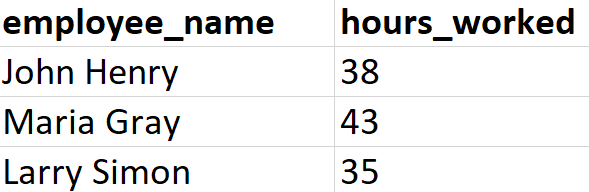
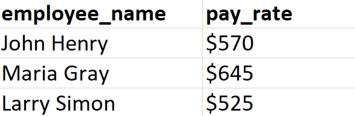

# Scenario
You are an HR manager and you need to create a file containing wages for your employees calculated by their hours.

# Aim
Read in a CSV file with the employee names and the hours worked, and then output another CSV file with their `pay_rate` calculated with the rate **1 hour * 15**.

# Steps for Completion

1. Go to your *main.py* file.

2. Using the `csv` imported module, write a script to read the contents of our `employees.csv` file that has the format shown in *Figure 8.5*:

*Figure 8.5*

3. Output a new CSV file called `wages.csv` which should have the format shown in *Figure 8.6*:

*Figure 8.6*

Here, wages are calculated using the formula, `hours_worked * 15`.

Make sure you've generated the output file by running *python3 main.py* and then verify that the content follows the correct format by clicking on the *wages.csv* file in your editor.

> Your output file does not need to include a **$**.

