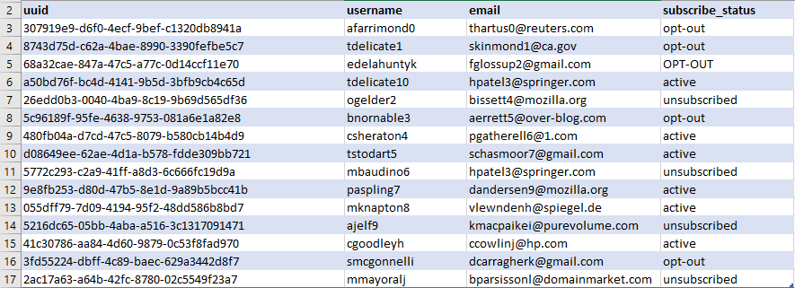

TargetCRM is a CRM software company that is currently looking for a way to improve the architecture of its solution. The software sends emails to registered users every week and today the system does not have a proper, structured way to persist the mailing list data, so the data is stored in in-memory data structures like dictionaries and lists. As working with data structures like dictionaries in Python might be memory (resource) consuming and not failure-proof (that is, any hardware/software failure might lead the data to be lost forever if the only place we have them is in memory), we need to move the project to a more robust, structured way of storing data.

Files are a great way to persist data, especially small to mid-size datasets. As a company effort to create a more robust infrastructure to store the email addresses data, they asked you to persist the user emails into csv files. CSV stands for comma-separated values. As the name implies, csv files store data with a comma character separating each field in the data file. The csv format was chosen because of the flexibility of working with this type of file and the great support from analytic tools, such as Excel, and, becoming more popular in recent years, BI tools. As data generated by the users grow, the company wants to use this data in the future to analyze it and get informative data from it.

Another facility to work with files is that we can distribute them in the company’s local environment to work in parallel. So, if the mailing list database increases in a pace that we cannot store every user in a single file, we can distribute the users among several csv files and process files separately, or in batches, and then gather them together when we need to perform some sort of analysis. This sort of capability is very desirable in today's real applications as the data generated by online users is increasing at a very fast pace.

The company is shifting from an in-memory persistence to a more robust strategy. To justify the investment on this new architecture, they will create a local server infrastructure to hold the data files. As csv files can take any number of columns (as long as they are comma-separated), it is very important that your algorithm writes a standardized data format for the case there are multiple csv files and there is a need to combine them in the future. Consider the scalability of your solution: if you have thousands of active users, you need a scalable architecture to handle this problem as the data gets larger. Therefore, if all the data is not viable to be stored in a single file, we will split the user data to be stored in multiple files.


<sup>_Figure 8.1: A snippet of the raw 'mailing_list.csv' file_</sup>

There is a problem with multiple files, however. Maintaining the integrity of the dataset is difficult. So, in order to make the integration easy, make sure that your files follow the same structure (for this assessment), otherwise the system could break.

TargetCRM asked you to implement a mechanism to read, process, and persist the data for its platform. For this task, you will be working with file operations. You will need to open the raw mailing list, saved in a csv file, filter the users that have been unsubscribed, and print back the resulting mailing list to another csv file.

> TargetCRM is a fictitious CRM software company especially created for the purpose of this code assessment.

In this assessment, you will need to read the mailing list from the sample file shown in _Figure 8.1_, update the mailing list by filtering out the users with the flag different from "active", and write the results back to another csv file.

To update the mailing list, there are some requirements:

- Remove users that contain the attributes "opt-out", "unsubscribed", or "OPT-OUT" from the list (hint: use `str.lower()` to transform strings to lowercase)
- The system only sends messages to corporate emails, so filter out 'gmail' users
- Return a list of the user ids that are able to be notified, that is, the remaining users

You will create a user-defined `mailinglist_validation_util()` function that receives the following parameters:

- Input filename
- Output filename
- File read/write option

Then you will save the output, that is, the ids of the active users, into the resulting csv file

Input:

```python
mailinglist_validation_util('mailing_list.csv','updated_mailing_list.csv', ['r+', 'w+'])
```

Output:

```
A csv file of length 5 with the output of the mailinglist_validation_util function.
```

In order for you to start this activity, we will provide a function template that can be followed to solve this challenge. The code block below is a sample way that this project could be structured.

To make this challenge code more readable, we can divide each task into a separate function: one function to read the raw file, a second to write back the results and a third one to call the other two.

Finally, create a python module to encapsulate the functions you just created in order to make this code reusable by other files or even other python projects.

In order for you to start this assessment, we will provide a function template that can be followed to solve this challenge. The code block below is a sample way that this project could be structured.

To make this assessment code more readable, we can divide each task into a separate function: one function to read the raw file, a second to write back the results and a third one to call the other two.

Finally, create a python module to encapsulate the functions you just created in order to make this code reusable by other files or even other python projects:

```python
import mailinglist_validation_util from mailinglist_util
```

You will create another file and call it _main.py_. This file will serve as a tester to your package. To check that everything is in place and working properly, create a function that calls the function from your package and return the results. The resulting output must be the same as the previous example, except that now you’re calling the function from a user-defined package. This will be explained in more details in the following tasks.
